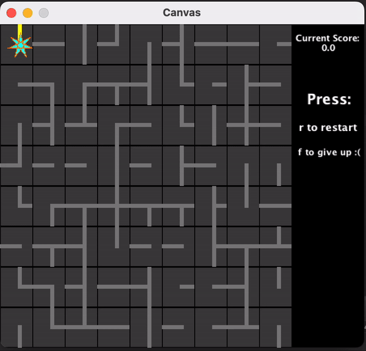

<h1 align="center">LightEmAll</h1>

This is LightEmAll! LightEmAll is a strategy, puzzle-based game with the main target of the game to connect all of the pieces in order to "light up" the game. The game starts with a main power starter in the top left, with surroundling powerlines spanning acorss the rest of the game board. THe player is supposed to connect all the powerlines together by clicking on each piece, which rotates it 90 degrees. Once pieces are connected and lit up, use your keyboard to more the power started across the grid. Enjoy!

## ‼️Disclaimer‼️

This code is not to be used for college assignments. The code is uploaded to my github as part of my portfolio, but as you all know, this code may not be used as plagiarism and I do not conde any acts made through the **theft** of this code. Other than that though, enjoy!
